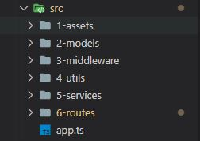
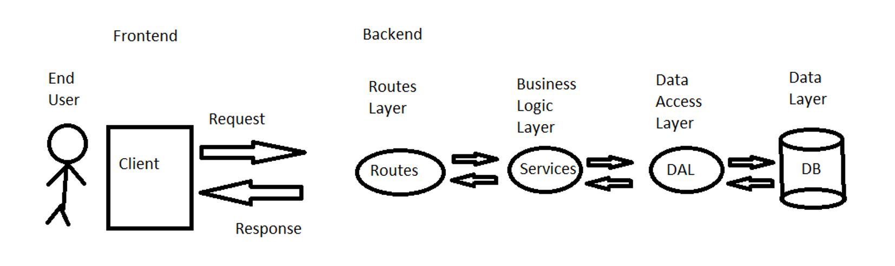
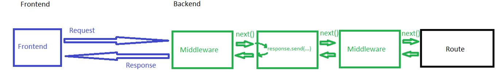

## NodeJs
  1. [Basics](#Basics)
  1. [NodeJs Installations](#NodeJs-installations)
  2. [Project structure](#Project-structure)
  3. [Node js layered architecture](#Node-js-layered-architecture)
  4. [Middleware](#Middleware)


## **Basics**

Node.js can run javascript on backend server, without browser.
We can implement typescript in Node.js.
There is no window object in Node.js, neither document, alert, browser..

Packages:
Package is an complete Node.js project' and can include many JS (or TS) files.

Modules:
Single js or ts file.
Node.js automatically wraps any module with IIFE (immediatly invoked function expression).
Modules can be:
- Custom module - module that we creating in our projects. Module name is the js (or ts) file name.
- NPM module - the packages and modules that we install from NPM servers. It will be in node_modules folder
- Built-in module - those modules is included in node.js by default and no need to install them.

Package.json file:
Its an project settings file. We can create it with "npm init -y".

Nodemon:
With nodemon we can run node.js with hot-reloading. 

## **NodeJs Installations**

> NodeJs project install:
```
1. npm init -y  => creates package.json project config file.
2. npm i -g nodemon => global install of nodemon tool to hot-reloading.
3. npm i -g ts-node =>  global install of nodejs typescript.
4. npm i @types/node -D => project install of types for nodejs, we install it only for devDependencies (-D).
5. Create tsconfig.json config file with:
    {
        "compilerOptions": {
            "target": "ES6",
            "esModuleInterop": true,
            "moduleResolution": "Node",
        }
    }
6. npm i express => express install, library to manage REST API. 
7. npm i @types/express -D => types for express (with -D)
```
> Tools that may be useful:
```
1. npm i -g javascript-obfuscator  => tool to transform code to make it harder to understand and steal.
2. Postman utility for debugging our server application.
```


## Project structure
Root will contain project config files (package.json, package-lock.json, tsconfig.json) and src folder.

src folder will contain this:



The app.ts file 

## Node js layered architecture

A small app consists of three (3) layers: Router Layer, Service Layer, and Data Access Layer (DAL). The number of layers will depend on how complex your app turns out. Router Layer contains the app programming interface (API) routes of the app. Its only job is to return a response from the server.

.

## Middleware

This is a function that is performed automatically between the Request and the Response.

Everything we want to do automatically can be done in middleware, such as writing to logs, preventing malicious information, checking tokens...

Middleware can be registered at the level of the entire site or at the level of a specific route.

Middleware can perform some activity and then continue the flow to the next Middleware or Route (if it exists just before the Route). This is by calling the  NextFunction() function.

Order of middleware registration will be the order of the flow (we register it usually in app.ts).

Middleware can break the flow and return the response:



## Error handling

Handling errors mechanism is an must-have part of server-side application.

> #### **Common scenarios are:**
>
> - Unexpected errors, that can caused by internal app failure.
> - Route not found error.
> - User errors - based on data from user - for example 'given username already exists in database' etc...

When error occurs, server typically returns  error object with error code and error message.

### Common errors are:

- 500 - Server internal error
- 404 - Page not found, resource not found (id based route)
- 400 - Validation error
- 401 - Unauthorized error
- 403 - Forbidden (Permission denied)

### Unexpected/unknown errors catch:

There is special middleware function, that gets 4 arguments: err obj, request, response, next. 
If some middleware trigger this function, it's skips all other flows and get to this middleware function. Its easy to think about it like all the flow (with all middlewares) was in an "try" segment, while this special middleware is an "catch" segment. 


It is an good practice to wrap all application routes with try catch code, and pass the error to next(err) (catch-all) middleware.
**We must register it after all routes.**
Here is code example:
```
import { NextFunction, Request, Response } from "express";

function catchAll(err: any, request: Request, response: Response, next: NextFunction) {
    
    // Display/log error

    // Find status code: 
    const statusCode = err.status || 500; // Short Circuit

    // Send back error details to frontend:
    response.status(statusCode).send(err.message);
}

export default catchAll;
```
### Route not found error:

1. Create middleware function that creates RouteNotFoundError (we will describe user errors in next paragraph), and pass it to catch-all: 
```
function routeNotFound(request: Request, response: Response, next: NextFunction) {
    const err = new RouteNotFoundError(request.originalUrl);
    next(err);
}
``` 
2. Register routeNotFound as middleware, after all  middlewares and routes, just before the last catch-all middleware:
```
//register application routes and middlewares...

// Route not found middleware:
server.use("*", routeNotFound);

// Register catch-all middleware:
server.use(catchAll);
```

### User errors:

Validation, authorization and permission errors. We create them using userError model with base abstract ClientError class, and errors that extends that base:

```
// Base client error:
abstract class ClientError {

    public status: number;
    public message: string;

    public constructor(status: number, message: string) {
        this.status = status;
        this.message = message;
    }

}

// Route not found error: 
export class RouteNotFoundError extends ClientError {
    public constructor(route: string) {
        super(404, `Route ${route} not found`);
    }
}

// Resource not found error: 
export class ResourceNotFoundError extends ClientError {
    public constructor(id: number) {
        super(404, `id ${id} not found`);
    }
}

// Validation error: 
export class ValidationError extends ClientError {
    public constructor(message: string) {
        super(400, message);
    }
}

// Authorization error: 
export class UnauthorizedError extends ClientError {
    public constructor(message: string) {
        super(401, message);
    }
}
```


