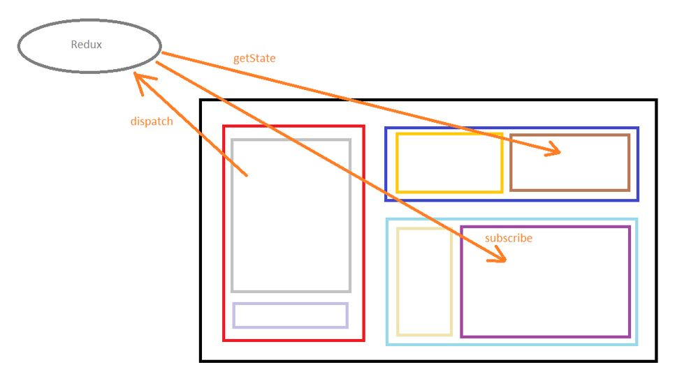

# React-Typescript-tutorials

## Table of Contents
  1. [Installations](#Installations)
  2. [Interpolation](#Interpolation)
  3. [Conditional rendering](#Conditional-rendering)
  4. [Displaying lists](#Displaying-lists)
  5. [Events](#Events)
  6. [Media](#Media)
  7. [Props](#Props)
  8. [State and side effect](#State-and-side-effect)
        - [useState](#useState)
        - [useEffect](#useEffect)
  9. [Routing](#Routing)
  10. [Ajax, Services, Models, AppConfig](#Ajax-Services-Models-AppConfig) 
  11. [Form handling](#Form-handling)
  12. [Redux](#Redux)


## **What is this?**

My main goal is to summarize the coding techniques we used to learn in React with Typescript, and provide simple example to each one. 

This is not about theory. 

I hope that this cheat sheet will help students not to drown at the start in interfaces, models, classes, React hooks itc... This specific material are based on React course in John Bryce, 2023 by lecturer Assaf Finkelshtein.  

## **Installations**

> React install, project install (ts template), run.
```
1. NodeJs install.
2. npm i -g create-react-app  => React global install on PC.
3. create-react-app my-project-name --template typescript  => Create React project.
4. npm start  => run React project.
5. npm i  =>  auto-download all packages in "dependencies" (while you run project on new workspace).
```
> Tools.
```
1. npm i -g react-cli-snippets  => tool to create React components, by Assaf Finkelshtein.
```

## **Interpolation**

> Wrapping the variables inline.
```
const percent = 10;
<span>Only today - {percent}% off on all store shoes!</span>
```
**[⬆ back to top](#table-of-contents)**


## **Conditional rendering**

> Show the content on condition. There is 3 main techniques: 

**1.** Interpolation with ternary operator: 
```
{ isWeekend() ? <span>Pizza 🍕 </span> : <span>Cake🎂</span> }
```
**2.** Short cuit - condition, then logic && or ||, then HTML to render:

```
{ isWeekend() && <span>Pizza 🍕 </span> }
```
**3.** Condition with other 'return' that return HTML.


```
if isWeekend() return <span>Today is weekend</span>;

return (
    <span>Today is regular day</span>
);
```
**[⬆ back to top](#table-of-contents)**


## **Displaying lists**

> Popular method to renders lists is map method: 
```
import "./Desserts.css";

function Desserts(): JSX.Element {

    const items = [ // Demo for getting the desserts from backend.
        { id: 1, name: "Apple Pie"},
        { id: 2, name: "Ice Cream"},
        { id: 3, name: "Pavlova"},
        { id: 4, name: "Eclair"}
    ];

    return (
        <div className="Desserts">
		    {items.map(item => <span key={item.id}>{item.name} 🍧 </span>)}
        </div>
    );
}

export default Desserts;
```
**[⬆ back to top](#table-of-contents)**


## **Events**

We can trigger functions from page events. Triggered function can be without args, with SyntheticEvent, or with customs args:

```
function Recommendations(): JSX.Element {

    // No arguments:
    function first(): void {
        console.log('click on btn');
    }

    // SyntheticEvent argument (or derivation):
    function second(args: SyntheticEvent): void {
        console.log(args);
    }

    // Getting my own arguments:
    function third(item: string, price: number): void {
        console.log(item, price);
    }

    return (
        <div className="Recommendations Box">

			<button onClick={first}>First</button>

			<button onClick={second}>Second</button>

			<button onClick={() => third("Apple Pie", 12)}>Third</button>

        </div>
    );
}
```

**[⬆ back to top](#table-of-contents)**


## **Media**

> Create Assets/Images folder, place the file there. Import it and use it as an "src" in img tag:

```
import imageSource from "../../../Assets/Images/dish.jpg";

function Dish(): JSX.Element {
    return (
        <div className="Dish">
            
        </div>
    );
}
```

**[⬆ back to top](#table-of-contents)**


## **Props**

> Props can be passed from parent to child element. Child should configure expected props type with 'interface':
```
interface SaleProps {
    discount: number;
    category: string;
}

function Sale(props: SaleProps): JSX.Element {
    return (
        <div className="Sale Box">
			<span>{props.discount}% discount on all {props.category}</span>
        </div>
    );
}
```
> And the parent pass props to child:
```
<Sale discount={10} category="Candies" />
```

**[⬆ back to top](#table-of-contents)**


## **State and side effect**


- **Hooks** - React system functions - we can't change their names. 

- **Lifecycle Hooks** - those special functions will work only in class component.

- **React Hooks** - those special functions will work only in functional component. They starts with keyword "use". Since we prefer to use FC, we focus on them.

### **useState**

State is an special variable. React monitors them, and if their values change, React will re-render the component.
> When we call to useState React hook - we also have to specify the type of data we want to manage, and the initial value to the state. The function returns array with 2 items:
**1.** The first item is actually a state variable.
**2.** The second item is an state setter, with that setter we set new values to state (this func is also an trigger to render page)

```
    const sellerNameArr = useState<string>("");
    const sellerName = sellerNameArr[0]; // First item in the array is the state variable we need.
    const setSellerName = sellerNameArr[1]; // Second item in the array is a function for changing the variable.
```
**3.** There is also short syntax to assign the state and setter func to variables - using Array Destructuring Assignment:
```
const [num, setNum] = useState<number>(0);
```
**4.** We also can use our custom created type:
```
const [product, setProduct] = useState<ProductModel>();
```
**[⬆ back to top](#table-of-contents)**


### useEffect

- **Side-Effect** - A React side-effect occurs when we use something that is outside the scope of React.js in our React components e.g. the Browser APIs like localStorage, AJAX calls, accessing browser Window object etc. We cant perform actions with side effect in our functional component! This will cause infinite loop. For those cases, we have useEffect rect hook.

> useEffect used to perform side-effect functionality in fc. There is 3 timing setups we can use:

**1.** Using this config, the function will run once on component build:
```
useEffect(()=>{
    // Component build will trigger this code
},[]);
``` 
**2.** Using this config it will run each time one of variables in array will change:
```
let a={}, b={}, c={};

useEffect(()=>{
    // Any change in a, b, c will trigger this code
},[a, b, c]);
``` 
**3.** Using this config, the the code in 'return' will be executed on component destroy:
```
useEffect(()=>{
    return() =>{
        // Component destroy will trigger this code
    }
},[]);

```
**4.** You can mix them together in one useEffect func:

```
let a={}, b={}, c={};

useEffect(()=>{
    // Code to run once on load
    return()=>{
        // Code to run on destroy
    }
},[a, b, c]);
```
**[⬆ back to top](#table-of-contents)**


## **Routing**
### **Install**
```
npm i react-router-dom @types/react-router-dom
```
**1.** The first step is to wrap our App with BrowserRouter tag:

```
import { BrowserRouter } from 'react-router-dom';

root.render(
    <BrowserRouter>
        <App />
    </BrowserRouter>
);
```

**2.** The best practice is to create routing component. It may include:
- Custom route, to different part of site/API
- Default route - what component should be loaded on default route
- Not-existing route - what component should be loaded on not-existing route

```
function Routing(): JSX.Element {
    return (

        <Routes>

            {/* Some Route: */}
            <Route path="/about" element={<About />} />

            {/* Default Route: */}
            <Route path="/" element={<Navigate to="/home" />} />

            {/* Page not found: */}
            <Route path="*" element={<PageNotFound />} />

        </Routes>

    );
}

export default Routing;
```

**3.** Then, we need to mount our Routing component somewhere in our site layout:
```
<main>
    <Routing />
</main>
```

**4.** Create navigation links. 
>  Don't use HTML a tag, since it have render problems. Use NavLink instead:
```
import { NavLink } from "react-router-dom";

function Menu(): JSX.Element {
    return (
        <div className="Menu">
            <NavLink to="/home">Home</NavLink>
            <NavLink to="/products">Products</NavLink>
            <NavLink to="/about">About</NavLink>
        </div>
    );
}

export default Menu;

```
**5.** Route from code, instead of NavLink:
> We use useRoute hook to do that:
```
import { useNavigate } from "react-router-dom";

function goHome(): JSX.Element {
    
    const navigate = useNavigate();
    
    function goHome(): void {
        navigate("/home");
    }

    return (
        <button onClick={goHome}>Home</button>
    );
}

```

**6.** Pass parameter in route - Route parameter:
> We can pass parameters passed in URL and handle it - this is popular technique to pass data.

Configure first the route parameter in route:
```
{/* Access to /products/details/value will pass 'value' to the receiver*/}
<Route path="/products/details/:prodId" element={<ProductDetails />} />
```
To get the parameter, use useParams:

```
const params = useParams();
const passedParameter = params.prodId; // will contain the passed value. 
```

**[⬆ back to top](#table-of-contents)**

## **Ajax, Services, Models, AppConfig** 

### **Concept**

The most standard task in  modern web application is sending HTTP request to external API. In React, we use axios library to perform the requests.

When we perform such request, the best practice to do is:

1. Create global 'AppConfig' and write the API URL there.
2. Create model class to describe returned data.
3. Create service class, who actually will perform axios requests.
4. Create component to render the returned data.

### **Install**
> npm i axios

### **AppConfig**

Class that contains common configuration to our application, for example the URL of the necessary resources. It should be in global scope, and can be accessed from anywhere in our app. Usually we will export instance of this class (its called "singleton"). For example:

```
class AppConfig {
    public registerUrl = "http://localhost:3030/api/auth/register/";
    public loginUrl = "http://localhost:3030/api/auth/login/";  
}

const appConfig = new AppConfig(); // Singleton
export default appConfig;
```

### **Model**

Class that describes pure data type of the returned object. For example employee obj, or product obj... To configure class variables without initialize, we should add to tsconfig.json this setting:
> "strictNullChecks": false

Example Model:
```
class CredentialsModel {
    public username: string;
    public password: string;
}

export default CredentialsModel;
```

### **Service**

This component performs only logic, and don't have UI. Usually we perform axios request and handle the response. Example:

```
import axios from "axios";
import ProductModel from "../Models/ProductModel";
import appConfig from "../Utils/AppConfig";

class ProductsService {

    // Get all products: 
    public async getAllProducts(): Promise<ProductModel[]> {

        // Get from REST API products: 
        const response = await axios.get<ProductModel[]>(appConfig.productsUrl);

        // Extract products: 
        products = response.data; // data will be ProductModel[]

        // Update global store: 
        productsStore.dispatch({ type: ProductsActionType.FetchProducts, payload: products });

        // Return:
        return products;
    }

}

const productsService = new ProductsService(); // Singleton

export default productsService;

```
**[⬆ back to top](#table-of-contents)**

## **Form handling**

Its very easy to work with form in React using useForm React hook.

### **Install**
> npm i react-hook-form

This library contains 3 main elements:

- Register function - we use it inline in the input HTML tag to get parameter that matched the parameter from model.
- handleSubmit function - uses to bridge submit event with our custom handler function(who gets data from the form).
- setValue function - used to set initial values to form fields.


> When we mess with file uploads, we need to convert its data type, since in browser we get file collection and not single file.

Example:
```
import { useForm } from "react-hook-form";
import ProductModel from "../../../Models/ProductModel";

function AddProduct(): JSX.Element {

    const { register, handleSubmit } = useForm<ProductModel>();

    async function send(product: ProductModel) {
        
        // Convert image type to "File" type (that are configured like this in model)
        product.image = (product.image as unknown as FileList)[0];
        
        // axios action to external API... 
    }

    return (
        <div className="AddProduct Box">
            <!-- handleSubmit will send the data from the form to 'send' function -->
            <form onSubmit={handleSubmit(send)}> 

                <label>Name:</label>
                <input type="text" {...register("name")} required minLength={2} maxLength={100} />

                <label>Price:</label>
                <input type="number" {...register("price")} required min={0} max={1000} />

                <label>Image: </label>
                <input type="file" accept="image/*" {...register("image")} />

                <button>Add</button>

            </form>

        </div>
    );
}

export default AddProduct;

```

**[⬆ back to top](#table-of-contents)**

## **Redux**

Redux is an JS library to manage states in global scope.

Every component in our application can access it, and perform CRUD actions. In additional, every component can subscribe to state and get triggers on state changes!

### **Install**
> npm i redux


### **Redux terminology**

Those are the possible interactions with Redux:
- getState - get data from global state object (read)
- dispatch - add/update/delete data from global state object
- subscribe - user can get triggers on state change.



### **Redux setup**


**1.** AppState - global state, available in global application scope. Configured in class. For example, products array will be described in ProductState class:
```
// 1. Products State - The application level state regarding products: 
export class ProductsState {
    public products: ProductModel[] = []; // ProductModel is an model that describes the product object
}
```
**2.** ActionType - describes the actions we can perform on our AppState. We build the action list in enum.
```
// 2. Products Action Type - Which actions we can perform on our products global state
export enum ProductsActionType {
    FetchProducts,
    AddProduct,
    UpdateProduct,
    DeleteProduct
}
```
**3.** Action - interface that describes object to perform one action on AppState. This object contains 'type' - what operation is requested, and the 'payload' - what data should be assigned to this type of operation:
```
// 3. Products Action - Interface describing an object for performing one action on our products global state:
export interface ProductsAction {
    type: ProductsActionType; // Which operation we're going to perform.
    payload: any; // What is the data related to that operation.
}
```
**4.** Reducer - the main function that perform actions on data and includes the logics. When we perform dispatch action (like update), we send action object (with type and payload), and its automatically passed to Reducer function. We never call the Reducer function directly, redux call automatically it when we do dispatch actions. Redux pass to Reducer function 2 arguments: 

- (a) The current AppState object
- (b) The Action object that we send in dispatch (action object includes type and payload)

Reducer function can't change the received state. So, we must copy received state, do needed action on copied object, and return the modified copy.

```
// 4. Products Reducer - The main function performing the needed action.
export function productsReducer(currentState = new ProductsState(), action: ProductsAction): ProductsState {

    // Duplicate current state into a new state:
    const newState = { ...currentState };

    // Perform the needed action on the newState:
    switch (action.type) {

        case ProductsActionType.FetchProducts: // Here, the payload is all products for saving
            newState.products = action.payload;
            break;

        case ProductsActionType.AddProduct: // Here, the payload is a product object for adding
            newState.products.push(action.payload);
            break;

        case ProductsActionType.UpdateProduct: // Here, the payload is a product object for updating
            const indexToUpdate = newState.products.findIndex(p => p.id === action.payload.id);
            if (indexToUpdate >= 0) {
                newState.products[indexToUpdate] = action.payload;
            }
            break;

        case ProductsActionType.DeleteProduct: // Here, the payload is the product id for deleting
            const indexToDelete = newState.products.findIndex(p => p.id === action.payload)
            if (indexToDelete >= 0) {
                newState.products.splice(indexToDelete, 1);
            }
            break;
    }

    // Return the newState: 
    return newState;
}
```
**5.** Store - Create the store object and start redux mechanism - we pass the reducer as an argument.

```
// 5. Products Store - The manager object handling redux:
export const productsStore = createStore(productsReducer);

```


**[⬆ back to top](#table-of-contents)**
